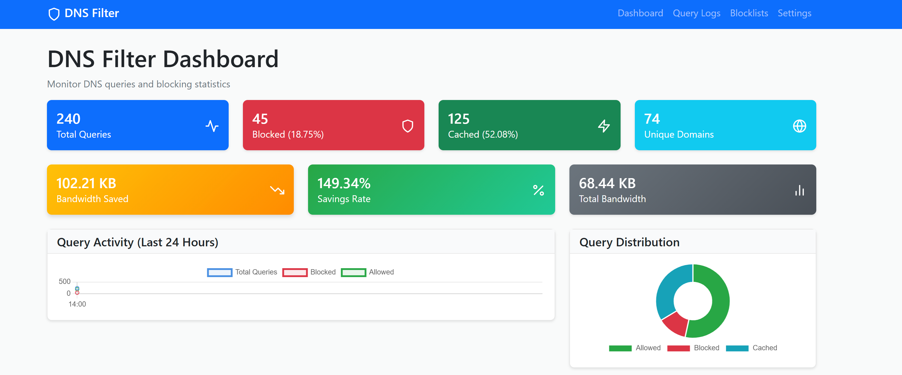
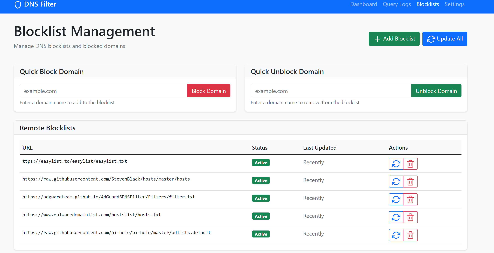

# Rafah DNS Filter

A cross-platform DNS filtering application inspired by Pi-hole, providing DNS query interception, caching, bandwidth monitoring, and blocking capabilities with a modern web dashboard.


## 🌟 Features

- **DNS Query Filtering**: Intercepts and filters DNS queries with custom blocklists
- **Advanced Caching**: In-memory DNS response caching with TTL support
- **Bandwidth Monitoring**: Track data usage and savings from blocking and caching
- **Web Dashboard**: Modern, responsive web interface with real-time statistics
- **Blocklist Management**: Support for local and remote blocklists with automatic updates
- **Query Logging**: Comprehensive logging with detailed analytics
- **Real-time Monitoring**: Live dashboard with interactive charts
- **Cross-platform**: Works on Windows, Linux (Ubuntu), and macOS
- **Performance Analytics**: Response time tracking and cache efficiency metrics

## 📊 Bandwidth Savings

The application calculates and displays:
- **Data saved** through domain blocking (prevents HTTP requests)
- **Cache efficiency** savings (reduces upstream DNS queries)
- **Percentage savings** with detailed breakdowns
- **Real-time bandwidth** usage monitoring

## 🖥️ Platform Support

### Windows
- DNS server on port 53 (requires administrator privileges)
- Windows Service integration
- Native Windows installer support

### Linux/Ubuntu
- DNS server on port 53 (non-privileged)
- Systemd service integration
- UFW firewall configuration

## 📋 System Requirements

- **Python**: 3.8 or higher
- **Memory**: Minimum 512MB RAM (1GB recommended)
- **Storage**: 100MB free disk space
- **Network**: Internet connection for blocklist updates

## 🚀 Quick Start

### Clone Repository
```bash
git clone https://github.com/yourusername/dns-filter.git
cd dns-filter
pip install -r requirements.txt
python main.py
```

### Platform-Specific Setup

#### Windows
```bash
pip install dnslib flask requests
python main.py
```

#### Ubuntu/Linux
```bash
chmod +x setup_ubuntu.sh
./setup_ubuntu.sh
```

## 🌐 Web Dashboard

Access the dashboard at `http://localhost:5000`

### Dashboard Features
- Real-time DNS query statistics
- Bandwidth usage and savings metrics
- Interactive charts and graphs
- Blocklist management interface
- Query logs with filtering options
- System configuration settings

## ⚙️ Configuration

### Main Configuration (`config.json`)
```json
{
  "dns_host": "0.0.0.0",
  "dns_port": 53
  "web_host": "0.0.0.0",
  "web_port": 5000,
  "upstream_dns": ["8.8.8.8", "8.8.4.4", "1.1.1.1"],
  "cache_size": 10000,
  "cache_ttl": 300,
  "log_queries": true,
  "enable_blocking": true,
  "cleanup_days": 30
}
```

### Blocklist Configuration



Add remote blocklists via the web interface or directly in the database:

```python
# Popular blocklists
steven_black = "https://raw.githubusercontent.com/StevenBlack/hosts/master/hosts"
adguard_dns = "https://adguardteam.github.io/AdGuardSDNSFilter/Filters/filter.txt"
```

## 🧪 Testing

### DNS Resolution Testing
```bash
# Test allowed domain
dig @127.0.0.1 -p 53 google.com

# Test blocked domain (should return NXDOMAIN)
dig @127.0.0.1 -p 53 facebook.com
```

### Bandwidth Monitoring Test
1. Access the dashboard at `http://localhost:5000`
2. Generate DNS queries to see real-time statistics
3. Monitor bandwidth savings metrics

## 📁 Project Structure

```
dns-filter/
├── main.py                 # Application entry point
├── dns_server.py           # DNS server implementation
├── web_dashboard.py        # Flask web interface
├── database.py             # SQLite database manager
├── blocklist_manager.py    # Blocklist handling
├── dns_cache.py            # DNS response caching
├── bandwidth_monitor.py    # Bandwidth tracking
├── config.py               # Configuration manager
├── config.json             # Main configuration file
├── requirements.txt        # Python dependencies
├── setup_ubuntu.sh         # Ubuntu setup script
├── templates/              # HTML templates
│   ├── index.html          # Main dashboard
│   ├── logs.html           # Query logs page
│   ├── blocklists.html     # Blocklist management
│   └── settings.html       # Configuration settings
├── static/                 # Static web assets
│   ├── style.css           # Application styles
│   └── app.js              # JavaScript functionality
├── blocklists/             # Default blocklist files
│   └── default.txt         # Default blocked domains
└── docs/                   # Documentation
    ├── installation.md     # Installation guide
    ├── configuration.md    # Configuration reference
    └── api.md              # API documentation
```

## 🔧 Development

### Local Development Setup
```bash
git clone https://github.com/yourusername/dns-filter.git
cd dns-filter
python -m venv venv
source venv/bin/activate  # On Windows: venv\Scripts\activate
pip install -r requirements.txt
python main.py
```

### Contributing
1. Fork the repository
2. Create a feature branch (`git checkout -b feature/amazing-feature`)
3. Commit your changes (`git commit -m 'Add amazing feature'`)
4. Push to the branch (`git push origin feature/amazing-feature`)
5. Open a Pull Request

## 📊 API Endpoints

### Statistics API
- `GET /api/stats` - Get query statistics
- `GET /api/hourly-stats` - Get hourly breakdown
- `GET /api/bandwidth-stats` - Get bandwidth metrics

### Management API
- `POST /api/domain/block` - Block a domain
- `POST /api/domain/unblock` - Unblock a domain
- `POST /api/blocklists/update` - Update blocklists

## 🛠️ Troubleshooting

### Common Issues

**Port Already in Use**
```bash
# Check what's using the port
sudo netstat -tulpn | grep :53
```

**Permission Denied**
```bash
# For DNS port binding on Linux
sudo setcap CAP_NET_BIND_SERVICE=+eip $(which python3)
```

**Web Dashboard Not Accessible**
- Check firewall settings
- Verify the application is running
- Ensure port 5000 is not blocked

## 📝 License

This project is licensed under the MIT License - see the [LICENSE](LICENSE) file for details.

## 🙏 Acknowledgments

- Inspired by [Pi-hole](https://pi-hole.net/)
- Built with [Flask](https://flask.palletsprojects.com/) and [dnslib](https://github.com/paulc/dnslib)
- UI components from [Bootstrap](https://getbootstrap.com/)

## 🔗 Links

- [Documentation](docs/)
- [Issues](https://github.com/yourusername/dns-filter/issues)
- [Discussions](https://github.com/yourusername/dns-filter/discussions)
- [Wiki](https://github.com/yourusername/dns-filter/wiki)

## 📈 Roadmap

- [ ] Docker container support
- [ ] Windows installer package
- [ ] Mobile app for monitoring
- [ ] Advanced filtering rules
- [ ] Integration with threat intelligence feeds
- [ ] Multi-user support with authentication
- [ ] API rate limiting
- [ ] Export/import configuration
